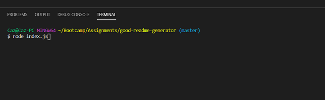
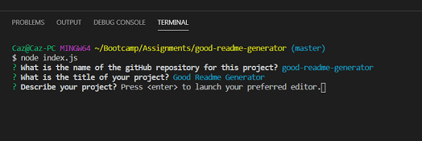
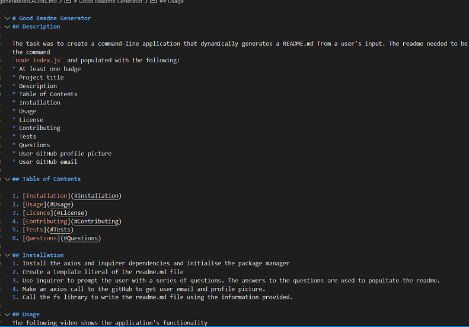

# Good Readme Generator
Node.js and ES6
 \

## Description
The task was to create a command-line application that dynamically generates a README.md from a user's input. The readme needed to be invoked with the command
`node index.js` and populated with the following:
* At least one badge
* Project title
* Description
* Table of Contents
* Installation
* Usage
* License
* Contributing
* Tests
* Questions
* User GitHub profile picture
* User GitHub email

## Table of Contents
1. [Installation](#Installation)
2. [Usage](#Usage)
3. [Technologies](#Technologies)
4. [Credits](#Credits)
5. [Licence](#License)

## Installation
1. Install the axios and inquirer dependencies and initialise the package manager
2. Create a template literal of the readme.md file
3. Use inquirer to prompt the user with a series of questions. The answers to the questions are used to popultate the readme.
4. Make an axios call to the gitHub to get user email and profile picture.
5. Call the fs library to write the readme.md file using the information provided.

## Usage
The following images show the application's functionality.
Initialise the application by typing node index.js into the command line.

You will then be asked a series of questions to answer directly into the command line or your preferred text editor.

After all is complete a readme is generated.

This is the link for the generated readme.md file
https://github.com/CazB67/good-readme-generator/blob/master/generatedREADME.md

This is the URL of the gitHub repository
https://github.com/CazB67/good-readme-generator

## Technologies
NPM, Node js, fs, axios, inquirer, Javascript, util

## Credits
Team at UWA Coding Bootcamp

## License

